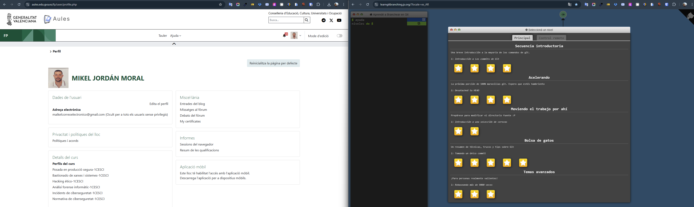
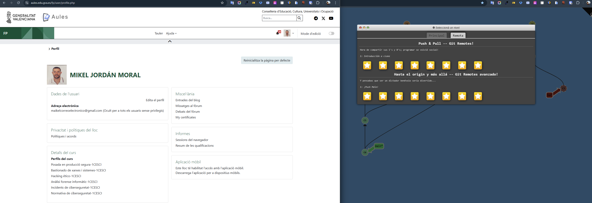

# 3. Apartado 3: Git Branching

Este documento acredita la realización del tutorial interactivo "Learn Git Branching", solicitado en la práctica RA1.

## 📸 Evidencias Gráficas

A continuación se muestran los resultados obtenidos en los dos bloques principales.

### 1. Nivel Principal (Main)
Se ha completado el flujo de trabajo básico con commits y ramas locales.

### 2. Nivel Remoto (Remote)
Se ha completado la simulación de trabajo con repositorios remotos (clone, push, pull).

---
*Capturas realizadas por Mikel Jordan Moral para la Práctica Puntuable RA1.*